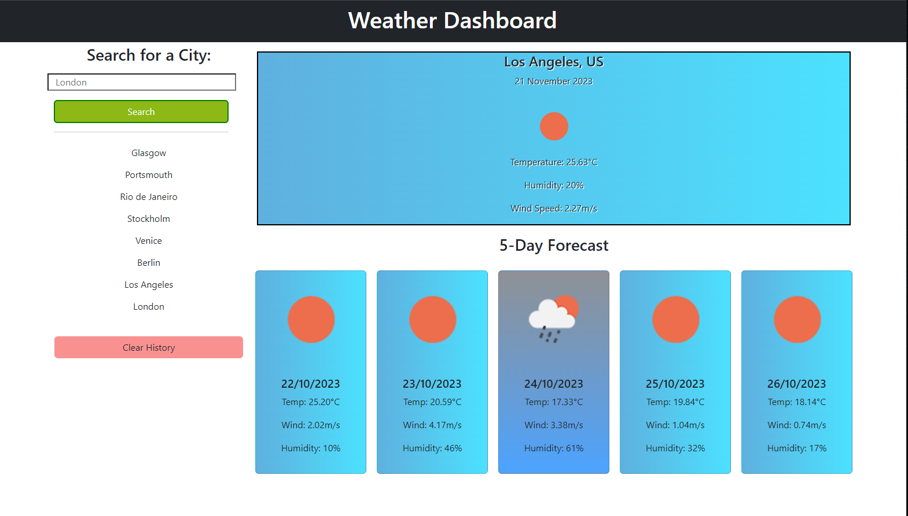
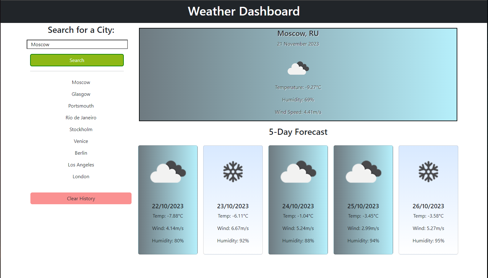
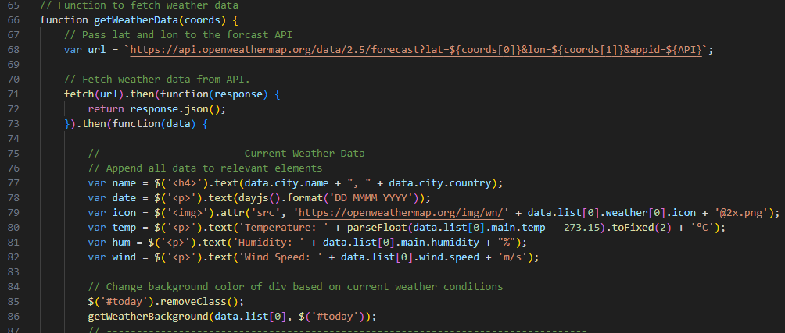

# weather-dashboard-bootcamp-challenge

## Description

A Weather Dashboard app built using the Open Weather API. This is the eighth assignment in the Front-end Skills Bootcamp. For this assignment, we have been tasked with developing a weather app which retrieves data using different APIs.

This application allows users to search for the current and future weather conditions in their desiered city. When the user searches for a city, they are presented with a series of `div`s displaying the current weather and the weather for the next 5 days. Each `div` displays the date, temperature, humidity, wind speed and a weather icon, to the user.

I used Bootstrap cards to display the 5-Day Forecast section of the page and each element features a background gradient that dynamically changes depending on the weather condition.
The pictures below show the layout of my application and how the backgrounds change depending on the weather conditions.

I used the DayJs API to get the dates and the Open Weather API to get the weather data.

The application also features a history section where the user's search history will be stored. The user can then click on these searches and they will be presented with the data for that city. I limited the length of the search history to 10 items and I added a button so the user can clear their history. I used JavaScript to dynamically generate the history buttons and added data attributes of the latitude and longitude.

The applications works by first using Open Weather's Geocoding API, this API takes the user's search and returns the latitude and longitude coordinates for that city. The coordinates are then passed into the Open Weather API and the weather data is returned.
The following code shows how the `getWeatherData()` function makes a fetch request to the API and displays the data on the page.

This assignment taught me how to effectively use and manipulate data retrieved via APIs.

## Installation

N/A

## Usage

The Weather App can be accessed via this link: https://satsumasegment.github.io/weather-dashboard-bootcamp-challenge/

Use the input box to search for a city name, the application will the return weather data based on that city. Click the buttons in the history section to display the weather data for these cities.
